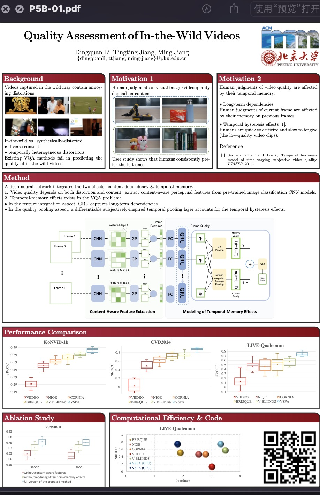

## Awesome Research Design (R&D) Poster Presentation
### Credits: Prof. Bolei Zhou (PowerPoint Templates) and Prof. Guanying Chen (LaTeX Templates)

* Poster 0 for MMSP'22 paper

[Check PowerPoint](NLNet_Poster_PowerPoint/NLNet_Poster.pptx?raw=true)

* Poster 1 for CVPR'15 paper

[Check PowerPoint](poster_cvpr15_CAM_PowerPoint/poster_cvpr15_CAM.pptx?raw=true)

* Poster 2 for CVPR'17 paper

[Check PowerPoint](poster_cvpr17_ade20k_PowerPoint/poster_cvpr17_ade20k.pptx?raw=true)

* Poster 3 for ECCV'18 paper

[Check PowerPoint](poster_eccv18_trn_PowerPoint/poster_eccv18_trn.pptx?raw=true)

* Poster 4 for ECCV'18 paper. This poster is mainly designed by Tete. 

[Check PowerPoint](poster_eccv18_upernet_PowerPoint/poster_eccv18_upernet.pptx?raw=true)

* Poster 5 for CVPR'18 paper. This poster is mainly designed by David Bau. I think the font size is bit small and the content is bit too dense.

[Check PowerPoint](poster_cvpr18_netdissect_PowerPoint/poster_cvpr18_netdissect.pptx)

* Poster 6

[Check LaTeX](https://github.com/SuperBruceJia/Poster_Template/tree/main/DeepHDRVideo_Poster_LaTeX)

* Poster 7

[Check LaTeX](https://github.com/SuperBruceJia/Poster_Template/tree/main/PS-FCN_Poster_LaTeX)

* Poster 8

[Check LaTeX](https://github.com/SuperBruceJia/Poster_Template/tree/main/SDPS-Net_Poster_LaTeX)

* Poster 9

[Check LaTeX](https://github.com/SuperBruceJia/Poster_Template/tree/main/TOM-Net_Poster_LaTeX)

* Poster 10

* Poster 11

* Poster 12

* Poster 13

---
Note: Last Update: Oct 31st, 2022
